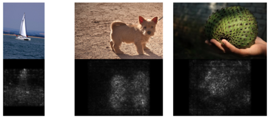
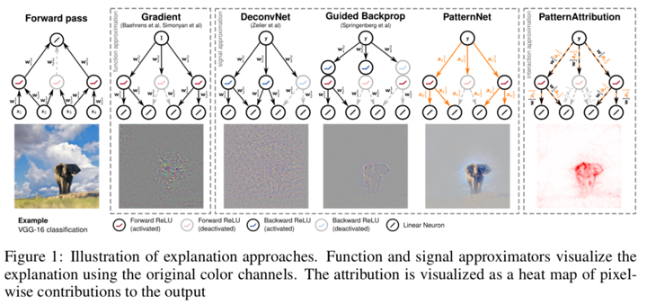
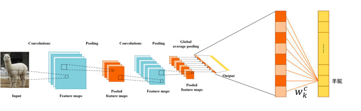
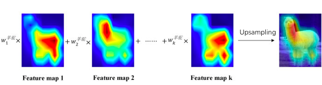
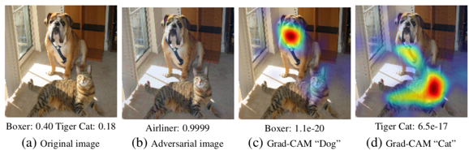
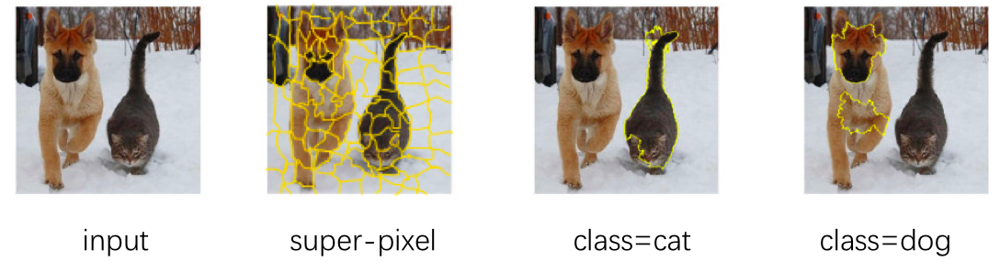
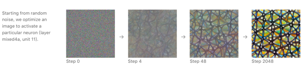
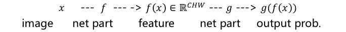

# 卷积神经网络的可解释性

梁浩宇 2018310817 计算机系

## 介绍

本学期的一次课介绍了神经网络的可解释性，恰逢本学期关注这方面的研究，故笔者对卷积神经网络进行了文献调研，与同学探讨并提出了自己的想法来提升**卷积神经网络通道语义的可解释性**，据此开展了一些初步的实验。

### 背景

在最近不到十年内，随着GPU加速技术和大量数据标注的出现，深度学习突飞猛进。其中起飞最早的卷积神经网络(CNN)已经成为大量计算机视觉、机器人等实用任务的基础。然而，现有的神经网络的特征空间与人类习惯的表示空间不同，给人类与神经网络的信息交换造成了重大的困难，一方面，人难以理解神经网络提取的特征，故而难以对网络进行故障诊断、难以将其学到的知识展示给人类；另一方面，神经网络难以利用人类的知识，不得不从大量数据中学习。这些缺陷，造成神经网络在安全领域得不到人们的信赖，如自动驾驶、医疗、军事、保险等。因此，在神经网络的特征空间与人类概念的空间之间架起桥梁，实现神经网络的可解释性显得尤为重要。考虑到CNN广泛的应用，本文将聚焦CNN的可解释性。

### 挑战

解释CNN特征的含义以及CNN进行预测的依据，主要面临以下几大挑战：

- CNN的特征空间与人类习惯的概念空间不一致，每个通道往往具有多种概念，一个概念往往对应多个通道。因此人类难以直接从CNN的特征表示中读取概念
- 根据理论分析，无监督地学习出依照概念解耦的特征表示是不可能的[^挑战]
- CNN的可解释性的定义以及评价指标不统一，不便于比较不同模型的可解释性

- 仅在训练后解释CNN，并不能提升CNN的可解释性(的指标)，也无法通过这些解释让CNN训练过程利用上人类的知识

### 我们的方法

针对这些挑战，特别是，解耦表示学习无监督是不可能的[^挑战]，我们尝试从**有监督**的思路出发去实现CNN特征的解耦。我们设计了一个可计算指标，来评价CNN特征空间中通道和分类类别的耦合程度。在CNN指定层，加入一组**稀疏**的门限来控制各个通道开闭。每个分类类别有一套这样的门限，尝试优化门限，来使得CNN只利用门限打开的**少数几个通道就能正确分类此类的图像**。优化后的门限，给出的分类交叉熵即为我们评价指标，它表示了特征通道依分类类别可解耦的程度。

我们以此指标为目标来提升网络的可解释性：**利用有类别标注的数据**来优化CNN的网络参数，从而使学习出的特征表示中，通道和分类类别具有稀疏的对应关系。我们称这一方法为通道解耦卷积神经网络(CDCNN, channels disentangled convolutional neural network)。

比起普通CNN，CDCNN具有以下良好的特性：不损伤分类准确率；具有更好的通道语义可解释性，每个通道只与一个或少数几个类别相关；并由于特征空间中类间距的增加，网络的抵抗黑盒攻击的鲁棒性也有提示。我们后续将在CDCNN（单层通道解耦）的基础上构建多层通道解耦的CNN，以完成层次化分类。在层次化分类中，此模型有望利用人类对类别层次的知识，使网络用更少的数据就能学习出分类所需的特征。

## 相关工作

CNN可解释性的大量工作集中在训练后解释，这是指模型训练完成后，对模型进行解释。这种方法只能将模型的特征表示、预测的依据等等转换为人能够理解的形式，但模型参数均固定，无法进一步无法改善模型的可解释性。

#### 网络归因：确定神经元对应的图像位置

解释CNN，一个重要的任务就是，搞清楚究竟是输入图像的那一部分，激活了网络的输出神经元或某个中间神经元。完成这一任务的方法有很多，现归纳如下：

##### 显著性图(Saliency map)

显著性图是将网络的输出或中间神经元的激活，对输入图像求导所得的图像。此图代表了图像上不同区域微小变化，会对这一激活产生多大的影；导数越大所的区域，对激活了那个神经元贡献越显著。

以解释输出神经元为例，输入图像$x$，输出第$c$类的logit为$logit_c$，则显著性图为
$$
SaliencyMap=\frac{\partial logit_c}{\partial x}
$$
直接求导的这一方法称为Gradient方法[^Simonyan 13]，是最早的显著性图方法。下图中，上一行是输入图像，上一行试试本方法得到的显著性图。

但由于回传到图像的梯度信号噪声很大，人们后来有提出了一些列不同的求导策略来提高其信噪比。如下图所示，回传时经过ReLU时，Gradient方法只对前传输入为正的ReLU回传梯度，DeconvNet[^Matthew 2014]则对梯度使用ReLU；Guided BackProp[^Springenberg 2015]同时使用了这两个变换。PatternNet和PatternAttribute[^Kindermans 17a]:则将前传激活分解成噪声和信号分量，其中噪声信号垂直于下一层的网络权重，用高斯分布来拟合，而信号分量是去掉噪声分量后的前传激活。PatternNet和PatternAttribute[^Kindermans 17a]回传的不再是原始的梯度，而是信号分量。

innvestage库实现了大量的基于Gradient进行改进方法，代码开源在 https://github.com/albermax/investigate 上。下图是该库中各种方法的展示。这些方法里面，PatternNet 和 PatternAttribution 方法效果最好，其信噪比最高。此外，PatternAttribution以外的方法都对输入变化不鲁棒，如在输入图像上帖上一块颜色，其他方法会无法正常产生的显著性图，而PatternAttribution这一现象很弱。

##### 类激活图(CAM, Class activation map)

类激活图方法可以确输出各类别分别位于输入图像的何处。

###### CAM

此方法最初在CAM一文[^Zhou 16]中提出。这一方法仅适用于GAP CNN，即最后一个卷积层后，是一次全局池化(GAP, gloabl average pooling)及一层全连接层，得到预测类别的logit，其网络结构如下图所示，

这不同于普通的CNN，如下图，最后一个卷积层后，将多通道的特征图排列成一维向量，然后经过多个全连接层，得到预测类别的logit。

如下图所示，GAP CNN的全连接层的权重$w_{k,c}$代表了通道$k$对类别$c$的贡献程度，

而通道$k$的特征图$A_k$又表示了通道$k$所捕捉的特征在图像中的大致位置，故以$w_{k,c}$为权重将$A_k$求和
$$
\sum_k {w_{k,c}}A_k
$$
称为类别激活图，代表了类别$c$在图像中的大致位置（将其上采样到原图尺寸）。

如下图所示，使用CAM，可以确定不同类别在图像中对应的大致区域。

###### Grad-CAM

Grad-CAM[^Selvaraju 16]将此方法从GAP CNN推广到普通的CNN，它使用梯度来模拟GAP的$w_{k,c}$。将第$c$类的logit，对于普通CNN的最高卷积层的通道$k$的特征图$A_k$求梯度，再算矩阵元素的平均，即为$w_{k,c}$
$$
w_{k,c}=\text{mean}(\frac{\partial logit_c}{\partial A_k})
$$
而对应的类别激活图为
$$
\text{ReLU}(\sum_k {w_{k,c}}A_k)
$$

Grad-CAM对于对抗样本(针对分类任务生成的)是鲁棒的，例如下图所示，即使在对抗样本上，Grad-CAM依旧可以找到不同类比对应的区域。

##### 局部黑盒解释(LIME, local interpretable model-agnostic explanations)

给定任意黑盒模型，使用LIME，可以确定是输入数据的哪些维度，让模型做出了当前的分类预测。这一方法适用于各种模型，如神经网络、决策树、SVM等皆可。其出发点是，在输入数据附近对模型做线性近似。具体做法是，在一个输入数据周围随机采样一些数据点，并这个模型来给他们分类，这样就得到了这些数据点的类别标注；而后，用一个线性分类器拟合这些数据，则线性分类器即近似了模型在该一个输入数据附近的行为。这个线性分类器的权重，代表了输入数据不同维度对分类结果的影响程度。

然而当输入数据是图像时，这件事情很困难，这是因为图像的维度很高、取值范围很大，故其附近采样规模要特别大，计算很不经济。因此，首先需要将图像使用超像素算法，如SLIC、quickshift，分割为若干小区域。接下来采样多组区域，将这些区域保留，余下区域去除(设为灰色)，得到多张图片，送给模型进行预测是否是指定类别。为了高效地进行采样，当保留区域少于6张时，采用前向搜索；其他情况采用脊回归或Lasso回归，来确定新的采样保留哪些区域。最终采样到足够图像，用其训练线性分类器，输入是多维二值向量(表示每个区域保留与否)，输入是二值分类预测（判断是否是指定的类比）。LIME可以指定模型输出端的任何类别，不同类别在原图中的位置均可找出。上述操作展示如下图。

这一方法的优点是，适用于所有图像分类模型，且能达到显著区域的精确轮廓；缺点是，由于需要采样超像素并多次用模型来分类，因此时间复杂度高。

#### 神经元可视化：确定神经元的代表图案

确定CNN每个神经元对应什么图案，称为神经元的可视化，通常会采用梯度来更新输入图像的方法。

著名的神经元可视化工作包括DeepDream[^deepdream]。 Feature  Visualization一文[^Chris 17]汇总比较了多种神经元可视化的方法，如下图所示具体做法是，将需要可视化的神经元、通道、网络层、某类logit或概率，计算其上神经元的激活值(的范数)，对输入图像求导，并用以更新输入的图像。

图像初始化为随机噪声，随着不断更新，将收敛到一个特定的图案。

实际上 ，这种方法得到的图片并利于人类理解，这是因为，所得图案有周期性，且可能含有多种语义概念，不同的人能做出不同的解读。对于人类的理解能力，理想状况应当是，每张图例只给出一个重要特征，尽可能接近原图的那种，不要周期重复。

#### 特征解释：确定特征空间中的语义概念

既然直接可视化神经元并不能满足人们理解特征的目的，人们专而研究如何在特征空间中确定语义概念。这个语义概念可以是纹理、颜色、材质、部件、物体、场景等。目前常见的思路主要有两种：在特征空间中确定概念的嵌入向量(embedding)，以及确定特征每个通道与哪些概念高度相关。

##### 概念激活向量测试 (TCAV, Testing with Concept Activation Vectors)

TCAV[^Kim 18] 是一种在神经网络的特征空间中确定概念的嵌入向量(embedding)的技术。其具体做法是，指定一个具体的概念$k$，准备一个数据集$\mathcal{D}_k$，其中的正样本是有该概念的图片，负样本是没有此概念的图片。而后指定需要考查的网络层，以CNN的卷积层为例，输入图像$x$，得到的此层的特征记做$f(x)\in \mathbb{R}^{CHW}$，其中$C,H,W$分别是特征的通道数、高、宽。则在特征空间的数据集为$f(\mathcal{D}_k)=\{f(x)|x\in \mathcal{D}_k\}$。用$f(\mathcal{D}_k)$训练一个线性分类器，分类器的权重归一后即为此概念对于的嵌入向量$v_k$。

基于此技术，还可以探测概念$k$对类别$c$的贡献。具体做法是，记类别$c$的预测概率为$g_c(f(x))$，测试集为$\mathcal{D}$。对输入数据，在考查的那一层的特征上，加上概念$k$的嵌入向量，预测类别$c$的概率会变高，则说明概念$k$对类别$c$有促进作用。如侠式，在测试集$\mathcal{D}$上求出升高的比率，可用于评价概念$k$对类别$c$的促进作用的强度，越大越强。
$$
I^+_{l,c}=\text{mean}_{x\in \mathcal{D}} \mathbb{I}\{g_c(f(x))<g_c(f(x)+v_k)\}
$$
类似的，还可以减去概念$k$的嵌入向量，计算类别$c$的概率会变低的的比率，也可用于评价概念$k$对类别$c$的促进作用的强度，越大越强。
$$
I^-_{l,c}=\text{mean}_{x\in \mathcal{D}} \mathbb{I}\{g_c(f(x))>g_c(f(x)-v_k)\}
$$

##### 神经元可解释性 (Unit Interpretability)

神经元可解释性[^Bau 17]，是一个评价CNN卷积层每个通道和语义概念相关度的指标。其思路是，将一个通道的特征图视作对概念的检测激活图，拿去和概念的分割标注图计算交并比。使用这个指标，需要测试集中的图像按照概念进行了分割标注。指标的具体计算方法是：

* 将特征图二值化：输入图像$x$，将第$k$通道的特征图$A_k(x)$大于阈值$T_k$的元素置1，其余置0，得到二值化的特征图$M_k(x)$
    $$
    M_k(x)= [\text{Upsample}(A_k(x))\geq T_k]
    $$

* 计算交并比：图像$x$喂给CNN，二值化的特征图$M_k(x)$与概念$c$的分割标注$L_c(x)$，去求交、并，将测试集中有概念$c$的图像的交、并面积求和，再做比，即为神经元可解释性，代表了通道$k$与概念$c$的相关程度，越大越相关
    $$
    IoU_{k,c}=\frac{\sum_{x \text{ has } c} ||M_k(x)\cap L_c(x)||}{\sum_{x \text{ has } c} ||M_k(x)\cup L_c(x)||}
    $$

使用这一指标，可以发现CNN越高的层，通道与纹理、部件、物体、场景的相关度越高，而与颜色、材质的相关度会越低或不变。

### 现有问题分析

上述方法帮助我们理解了CNN的特征语义以及分类的依据。但这些方法有以下几个局限性：

* 仅限于解释现有训练好的网络，并不能通过改变网络结构和参数，来进一步提升网络的可解释性。

* 只做到了人对网络特征的理解，没做到网络对人类知识的利用，并无法缓解深度学习对大规模数据的依赖。

* 无监督学习无法得到解耦的特征表示[^挑战]，我们需要有监督学习来实现特征表示的解耦，然而额外的标注(不论是TCAV的二分类标注、还是神经元可解释性的分割标注)都是昂贵的。

## 问题表述

我们的方法，利用分类类别标注**监督**CNN特征依照类别进行解耦。我们了一个指标，来评价CNN特征空间中通道和分类类别的耦合程度，并以此指标作为网络的一个正则项来训练网络，从而得到通道依类别解耦的特征，提升了通道语义的可解释性。

### 网络结构

一个CNN网络，可以表示成以下数学形式，输入是图像，输出是C个类别的概率
$$
f: \mathbb{R}^{\mathcal{C} \times H \times W} \mapsto \{\mathbf{p}\in [0,1]^C|\sum_cp_c=1 \}
$$
其中$\mathcal{C} \times H \times W$, 为输入图像的通道数、高、宽，$C$为分类类别数目

数据集$\mathcal{D}=\{(X,y)\}$，$X$为图像，$y$为标注类别

对于$(X,y)$，我们给CNN设计了两种前传的途径：

* 正常前传：输入图像$X$，输出预测类别概率的向量$\hat{y}$

$$
\hat{y}=f(X)
$$

* 加门限前传：在网络中间第 $l$卷积层加入门限，门限为一矩阵$W\in \{0,1\}^{K\times C}$代表了通道和类别的相关程度，为1则相关，为0则不相关。

    首先，前传得到第$l$卷积层的特征图$A$，特征图有$K$个通道
    $$
    A = f_{\leq l}(X)
    $$
    第$k$通道的特征图$A_k $，经过门限$W_{k,y}$变为

    $$
    \tilde{A}_k = W_{k,y} A_k
    $$

	而后再前传过后面的网络层，得到各类别预测概率的向量

    $$
    \hat{y}_W = f_{>l}(\tilde{A})
    $$

### 通道-类别稀疏度评分

对于给定的CNN的第$l$层，我们提出了两种评价其通道依类别可解耦的程度的指标

#### R0 原始评分

我们将通道$k$与类别$c$相关表述为：标注为类别$c$的图像，要正确分类，需要用到(打开)通道$k$。

依此表述，我们制定通道-类别稀疏评分(原始通道解耦评分)如下，越小则越可解耦
$$
R_0 = \min_W CE(y,\hat{y}_W) \\
s.t. W_k\text{ is one-hot}, \forall k \in \{1,2,...,K\}
$$
其意为，分类时**每个通道只被一个类别用到**，设法调整通道的分配，使**分类尽量正确**，则最终得到的交叉熵($CE$)即为可解耦长度的评分。

其中，$W_k\text{ is one-hot}$ 严格的数学表示是
$$
\begin{cases}
||W_k||_0=1\\
||W_k||_\infty=1\\
W_{k,c}\in \{0,1\}
\end{cases}
$$

#### R1 松弛评分

要求每个通道只被一个类别用到，过于严格，相近的类别往往会有公共的概念。因此，我们将这一要求松弛为，每个通道被少量（至少一个）的类别用到，也即每个通道和各个类别的关联关系是稀疏的。

将$R_0$中的$||W_k||_0=1$，用拉格朗日乘子法，引入到目标函数中
$$
\min_W \{ CE(y,\hat{y}_W)+\mu （||W||_0-1）\} \\
s.t. W\in\{0,1\}^{K\times C}, ||W_k||_\infty = 1,  \forall k \in \{1,2,...,K\}
$$
则评分松弛为
$$
R_1 = \min_W \{ CE(y,\hat{y}_W)+\mu ||W||_0\} \\
s.t. W\in\{0,1\}^{K\times C}, ||W_k||_\infty = 1,  \forall k \in \{1,2,...,K\}
$$
意为兼顾加门限后分类准确度和关联性的稀疏性，同样指标越小可通道解耦度越好。

### 问题

我们的问题是，如何训练CNN，可使其指定层的每个通道只提取少数类别的信息。利用前面定义的通道-类别可解耦度指标，我们提出了以下问题P0，并做了适当松弛以便求解。

#### P0 原始问题

**R0P0, R1P0**: 要使学出的CNN的R0或R1尽可能小，我们考虑以R0或R1作为网络的一个正则项，来训练网络
$$
\min_\theta CE(y,\hat{y})+\lambda R_i, \quad i=0,1
$$

其中$\theta$是网络参数（不含门限$W$）。

#### P1 协同优化

**R0P1**：代入$R_0 $的定义式到R0P0并化简，可知R0P0等价于
$$
\min_{\theta, W} CE(y,\hat{y}) + \lambda_1 CE(y,\hat{y}_W)\\
s.t. W\in\{0,1\}^{K\times C}, ||W_k||_0 = 1, ||W_k||_\infty = 1,  \forall k \in \{1,2,...,K\}
$$
**R1P1**：代入$R_1$的定义式到R0P1并化简，可知R0P1等价于
$$
\min_{\theta, W} CE(y,\hat{y}) + \lambda_1 CE(y,\hat{y}_W)+ \lambda_2 ||W||_0\\
s.t. W\in\{0,1\}^{K\times C}, ||W_k||_\infty = 1,  \forall k \in \{1,2,...,K\}
$$

#### P2 松弛

由于$W$是二值的，不方便优化，故改为$W \in [0,1]^{K\times C}$.

在R1P1中，$||W||_0 = ||W||_1$，而$||\cdot||_0$无法求导，故在P2中也考虑改为$||\cdot||_1$

关于稀疏正则项我们展开进一步讨论：

* 使每个通道只和少数类别**相关**(即$W_{k,c}\neq 0$)，且使每类只与少数通道相关，可用
    $$
    ||W||_1=\sum_k||W_k||_1 = \sum_c ||W_c||_1
    $$

* 若只鼓励最不稀疏的通道变得稀疏，可用

$$
||W||_{1,\infty}=\max_k ||W_k||_1
$$

* 为**多鼓励最不稀疏**的通道变得稀疏，可更改为

$$
||W||_{1,2}:= \sqrt{\sum_{k=1}^K ||W_k||_1^2}
$$

由于我们并不要求每类只与少数通道相关，故不选择$||W||_1$；由于$||W||_{1,\infty}$会使其他通道的门限得不到惩罚，不利于基于梯度的优化，故也不选择。$||W||_{1,2}$作为$||W||_1$ 和$||W||_{1,\infty }$之间的过渡，能避免后二者的弊端，故选择之。

故最终R1P1问题松弛为

**R1P2:**
$$
\min_{\theta, W} CE(y,\hat{y}) + \lambda_1 CE(y,\hat{y}_W)+ \lambda_2 ||W||_{1,2}\\
s.t. W\in [0,1]^{K\times C}, ||W_k||_\infty = 1,  \forall k \in \{1,2,...,K\}
$$

## 网络结构与优化方法

为了求解问题R0P1, R1P1, R1P2，我们设计了以下目标函数和算法

### 目标函数

R0P1:
$$
Loss_0=CE(y,\hat{y}) + \lambda_1 CE(y,\hat{y}_W)
$$
R1P1、R1P2:
$$
Loss_1=CE(y,\hat{y}) + \lambda_1 CE(y,\hat{y}_W)+ \lambda_2 ||W||_{1,2}
$$

### 算法一

求解R1P2：

通过对$W_k$归一化和裁剪来保证约束条件$W\in [0,1]^{K\times C}, ||W_k||_\infty = 1$
$$
W=W+\epsilon \frac{\partial Loss_1}{\partial W}\\
W_k = \frac{W_k}{||W_k||_\infty}\\
W=Clip(W,0,1)\\
\theta = \theta+\epsilon  \frac{\partial Loss}{\partial \theta}
$$
最终得到 $W_{k,c}\in [0,1]$

### 更新算法二

求解R1P1

换元
$$
\Omega \in [-1,1]^{K \times C}\\
W = \sigma(\frac{\Omega}{\delta})\\
\delta > 0
$$
更新时，用线性映射将$\Omega_k$最大、最小值对应到1、0到，以此保证约束条件$W\in [0,1]^{K\times C}, ||W_k||_\infty = 1$
$$
\Omega=\Omega+\epsilon \frac{\partial Loss_1}{\partial \Omega}\\
\Omega_k = 2 \frac{\Omega_k - \min \Omega_k}{\max \Omega_k - \min \Omega_k} - 1 \\
\theta = \theta+\epsilon  \frac{\partial Loss}{\partial \theta}
$$
训练过程中$\delta$按照某个时间表(自适应 或 在固定epoch减小？)变大，最终使得$W_{k,c}\rightarrow 0 $ 或 $W_{k,c}\rightarrow 1 $

### 更新算法三

求解R0P1

换元
$$
\Omega \in [-1,1]^{K \times C}\\
W_k = \text{softmax} (\frac{\Omega_k}{\delta})\\
\delta > 0
$$
更新时，用线性映射将$\Omega_k$最大、最小值对应到1、0到，以此保证约束条件$
$$
\Omega=\Omega+\epsilon \frac{\partial Loss_0}{\partial \Omega}\\
\Omega_k = 2 \frac{\Omega_k - \min \Omega_k}{\max \Omega_k - \min \Omega_k} - 1 \\
\theta = \theta+\epsilon  \frac{\partial Loss}{\partial \theta}
$$
训练过程中$\delta$按照某个时间表(自适应 或 在固定epoch减小？)变大，最终使得$W_{k}\rightarrow  \text{one-hot}$

## 实验结果

## 后续工作

层次化

[^挑战]: Locatello F, Bauer S, Lucic M, et al. Challenging Common Assumptions in the Unsupervised Learning of Disentangled Representations. ICML 2019. [http://arxiv.org/abs/1811.12359](http://arxiv.org/abs/1811.12359).

[^Simonyan 13]: Simonyan K, Vedaldi A, Zisserman A. Deep Inside Convolutional Networks: Visualising Image Classification Models and Saliency Maps. 2013. http://arxiv.org/abs/1312.6034.

[^Kindermans 17a]: Kindermans P-J, Schütt KT, Alber M, et al. Learning how to explain neural networks: PatternNet and PatternAttribution. 2017. http://arxiv.org/abs/1705.05598.

[^Matthew 2014]: Zeiler MD, Fergus R. Visualizing and understanding convolutional networks. ECCV 2014.
[^Springenberg 2015]: Springenberg JT, Dosovitskiy A, Brox T, Riedmiller.M Striving for simplicity: The all convolutional net. ICLR 2015.
[^Zhou 16]: Zhou B, Khosla A, Lapedriza A, Oliva A, Torralba A. Learning Deep Features for Discriminative Localization. https://doi.org/10.1109/CVPR.2016.319.
[^Selvaraju 16]: Selvaraju RR, Cogswell M, Das A, Vedantam R, Parikh D, Batra D. Grad-CAM: Visual Explanations from Deep Networks via Gradient-based Localization. 2016. http://arxiv.org/abs/1610.02391

[^deepdream]: Inceptionism: Going Deeper into Neural Networks. http://ai.googleblog.com/2015/06/inceptionism-going-deeper-into-neural.html
[^Chris 17]: Chris O, Alexander M, Ludwig S. Feature visualization.2017 https://distill.pub/2017/feature-visualization/

[^Kim 18]: Kim B, Gilmer J, Viegas F, Erlingsson U, Wattenberg M. TCAV: Relative concept importance testing with Linear Concept Activation Vectors. 2018
[^Bau 17]: Bau D, Zhou B, Khosla A, Oliva A, Torralba A. Network Dissection: Quantifying Interpretability of Deep Visual Representations. http://arxiv.org/abs/1704.05796.
[^Zhang 18b]: Zhang Q, Wu YN, Zhu S-C. Interpretable Convolutional Neural Networks. https://ieeexplore.ieee.org/document/8579018/
[^Chris  18]: Chris O, Arvind S, Ian J, Shan C, Ludwig S, Katherine Y, Alexander M. The Building Blocks of Interpretability. 2018. https://distill.pub/2018/building-blocks
